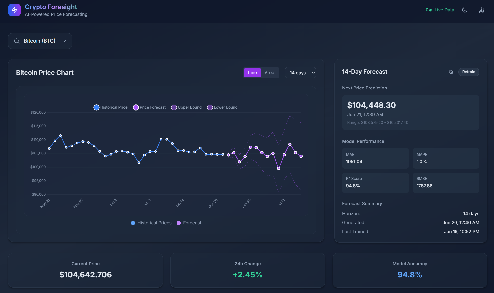

# Crypto Foresight

A modern, full-stack cryptocurrency price forecasting application powered by AI/ML models, featuring real-time updates and an intuitive React dashboard.

   

##  Application Preview



*Live Bitcoin price forecasting dashboard showing real-time data, 14-day predictions with confidence intervals, and comprehensive model performance metrics.*

##  Features

### Core Features
- **AI-Powered Forecasting**: Advanced ML models using Prophet and scikit-learn
- **Real-time Updates**: WebSocket connections for live price data
- **Modern Dashboard**: Responsive React frontend with Tailwind CSS and Chart.js
- **RESTful API**: Comprehensive FastAPI backend with automatic documentation
- **Technical Indicators**: Advanced feature engineering with SMA, EMA, RSI, MACD
- **Model Persistence**: Trained models stored as artifacts for fast predictions

### Supported Cryptocurrencies
- Bitcoin (BTC)
- Ethereum (ETH) 
- Solana (SOL)

### Model Features
- **Prophet Time Series**: Seasonal decomposition and trend analysis
- **Feature Engineering**: Technical indicators and price transformations
- **Model Validation**: Cross-validation and performance metrics
- **Configurable Horizons**: 1-30 day forecasting periods
- **Confidence Intervals**: Prediction uncertainty quantification

## 🏗 Architecture

```
crypto-forecasting/
├── backend/                 # FastAPI application
│   ├── api/                # API route handlers
│   │   ├── admin.py        # Admin endpoints
│   │   ├── forecast.py     # Forecasting endpoints
│   │   └── prices.py       # Price data endpoints
│   ├── services/           # Business logic services
│   │   ├── features.py     # Feature engineering
│   │   ├── forecast.py     # Prediction services
│   │   ├── market.py       # Market data services
│   │   └── train.py        # Model training
│   ├── tests/              # Test suites
│   │   ├── test_api.py     # API endpoint tests
│   │   └── test_services.py # Service layer tests
│   ├── artifacts/          # Trained model storage
│   │   ├── bitcoin/model.pkl
│   │   ├── ethereum/model.pkl
│   │   └── solana/model.pkl
│   ├── firebase_config.py  # Firebase configuration
│   ├── models.py           # Pydantic data models
│   ├── main.py             # FastAPI application
│   └── requirements.txt    # Python dependencies
├── frontend/               # React application
│   ├── src/
│   │   ├── components/     # React components
│   │   │   ├── ForecastCard.tsx
│   │   │   ├── Header.tsx
│   │   │   ├── PriceChart.tsx
│   │   │   └── TickerSearch.tsx
│   │   ├── hooks/          # Custom React hooks
│   │   │   └── useWS.ts    # WebSocket hook
│   │   ├── api.ts          # API service layer
│   │   └── App.tsx         # Main application
│   ├── package.json        # Node.js dependencies
│   └── vite.config.ts      # Vite configuration
├── config/                 # Configuration files
│   ├── default.yaml        # Default configuration
│   └── dev.yaml            # Development overrides
├── infra/                  # Infrastructure configurations
├── Makefile                # Build and development commands
└── LICENSE                 # Project license
```

## 🚀 Quick Start

### Prerequisites
- Python 3.11+
- Node.js 18+

### Option 1: Using Makefile (Recommended)

1. **Clone the repository**
```bash
git clone https://github.com/yourusername/crypto-forecasting.git
cd crypto-forecasting
```

2. **Complete setup for new users**
```bash
make setup
```

3. **Run development servers**
```bash
make run-dev
```

4. **Access the application**
- Frontend: http://localhost:5173
- Backend API: http://localhost:8000
- API Documentation: http://localhost:8000/docs

### Option 2: Manual Setup

1. **Backend setup**
```bash
# Create virtual environment
python -m venv .venv
.venv\Scripts\activate  # Windows
# source .venv/bin/activate  # Unix/macOS

# Install dependencies
pip install -r backend/requirements.txt

# Start backend server
cd backend
uvicorn main:app --reload --port 8000
```

2. **Frontend setup** (in a new terminal)
```bash
cd frontend
npm install
npm run dev
```

## 📊 API Endpoints

### Price Data
- `GET /api/prices/{symbol}` - Historical price data with configurable time range
- `GET /api/prices/{symbol}/current` - Current price and market data
- `GET /api/prices/{symbol}/stats` - Price statistics and analytics
- `GET /api/ohlcv/{symbol}` - OHLCV candlestick data

### Forecasting
- `GET /api/forecast/{symbol}` - Generate price forecast
- `POST /api/forecast/{symbol}/refresh` - Refresh forecast with new data
- `GET /api/forecast/{symbol}/metrics` - Model performance metrics
- `GET /api/forecast/{symbol}/validate` - Validate forecast accuracy

### Model Management
- `POST /api/train` - Start model training process
- `GET /api/status/{task_id}` - Check training status
- `GET /api/models` - List all trained models
- `DELETE /api/models/{symbol}` - Remove trained model

### WebSocket Endpoints
- `WS /ws/prices/{symbol}` - Real-time price updates
- `WS /ws/forecasts/{symbol}` - Real-time forecast updates

### Administrative
- `GET /api/health` - Application health check
- `GET /api/metrics` - System performance metrics

## 🔧 Configuration

The application uses YAML configuration files located in the `config/` directory:

- [`default.yaml`](config/default.yaml) - Base configuration
- [`dev.yaml`](config/dev.yaml) - Development overrides

### Key Configuration Options

```yaml
model:
  horizon: 7                    # Forecast horizon in days
  prophet:
    changepoint_prior_scale: 0.05
    seasonality_prior_scale: 10.0
    n_iter: 1000
  features:
    include_sma: true
    sma_windows: [7, 14, 30]
    include_rsi: true
    rsi_period: 14

service:
  host: "0.0.0.0"
  port: 8000
  cors_origins:
    - "http://localhost:3000"
    - "http://localhost:5173"
```

## 🧪 Model Training

### Command Line Training
```bash
cd backend
python services/train.py --symbol bitcoin --horizon 7
```

### Using Makefile
```bash
make train SYMBOL=bitcoin HORIZON=7
```

### API Training
```bash
curl -X POST "http://localhost:8000/api/train" \
  -H "Content-Type: application/json" \
  -d '{
    "symbol": "bitcoin",
    "horizon": 7,
    "features": {
      "include_sma": true,
      "include_rsi": true,
      "include_macd": true
    }
  }'
```

## 🧪 Testing

### Run Backend Tests
```bash
make test
# or
cd backend && python -m pytest tests/ -v
```

### Run Frontend Tests
```bash
cd frontend && npm run test
```

### Code Quality
```bash
make lint
```

## 📈 Technical Stack

### Backend
- **Framework**: FastAPI with async/await support
- **ML Libraries**: Prophet, scikit-learn, pandas, numpy
- **API**: RESTful endpoints with automatic OpenAPI documentation
- **WebSockets**: Real-time data streaming
- **Testing**: pytest with asyncio support

### Frontend
- **Framework**: React 18 with TypeScript
- **Styling**: Tailwind CSS for responsive design
- **Charts**: Chart.js with react-chartjs-2
- **State Management**: SWR for data fetching
- **Build Tool**: Vite for fast development and builds
- **Icons**: Heroicons for consistent UI

### Data & ML
- **Time Series**: Prophet for seasonal forecasting
- **Features**: Technical indicators (SMA, EMA, RSI, MACD)
- **Validation**: Cross-validation and performance metrics
- **Storage**: Pickle serialization for model persistence

## 🛠 Development Commands

```bash
# Complete setup
make setup

# Development servers
make run-dev

# Code quality
make lint
make test

# Model training
make train SYMBOL=bitcoin HORIZON=7

# Cleanup
make clean
```

## 📁 Key Files

- [`backend/main.py`](backend/main.py) - FastAPI application entry point
- [`backend/models.py`](backend/models.py) - Pydantic data models
- [`backend/services/forecast.py`](backend/services/forecast.py) - Core forecasting logic
- [`frontend/src/App.tsx`](frontend/src/App.tsx) - Main React application
- [`frontend/src/components/PriceChart.tsx`](frontend/src/components/PriceChart.tsx) - Price visualization
- [`config/default.yaml`](config/default.yaml) - Application configuration

## 🚀 Getting Started Summary

1. **Clone**: `git clone <repo-url>`
2. **Setup**: `make setup`
3. **Run**: `make run-dev`
4. **Access**: http://localhost:5173

---

**Built with ❤️ for the crypto community**